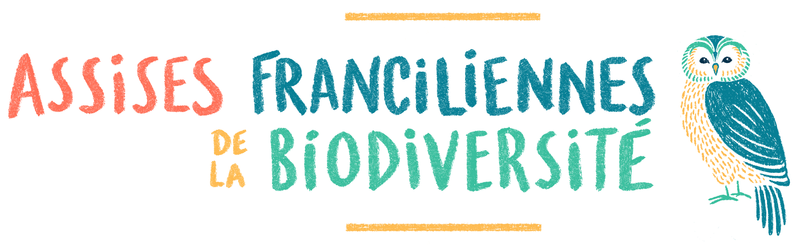

## Débats, arènes et ressources

Groupes | Sujet de débat et dossier pdf | Arène thématique (vendredi) | Arène territoriale (samedi) |
1 et 17 | [Les rats à Paris: invasion et cohabitation](resources/rats-paris.pdf) | L'évolution des écosystèmes franciliens | Paris |
2 et 18 | [Printemps silencieux franciliens? Recenser et protéger les populations d’oiseaux](resources/printemps-silencieux-franciliens.pdf) | L'évolution des écosystèmes franciliens | Paris |
3 et 19 | [Origines et mutations de la flore francilienne](resources/origines-mutations-flore-francilienne.pdf) | L'évolution des écosystèmes franciliens | Petite couronne |
4 et 20 | [Les aéroports, hotspots de la biodiversité locale?]() | L'évolution des écosystèmes franciliens | Petite couronne |
5 et 21 | [La nouvelle fable des abeilles: des insectes au service du bien commun]() | L'évolution des écosystèmes franciliens | Grande couronne |
6 | [Printemps silencieux franciliens? Recenser et protéger les populations d’oiseaux](resources/printemps-silencieux-franciliens.pdf) | L'évolution des écosystèmes franciliens | Grande couronne |
7 et 22 | [L'agriculture urbaine peut-elle être un moyen de reconquête de la biodiversité en ville ?]() | L'entretien de milieux favorables à la biodiversité | Paris |
